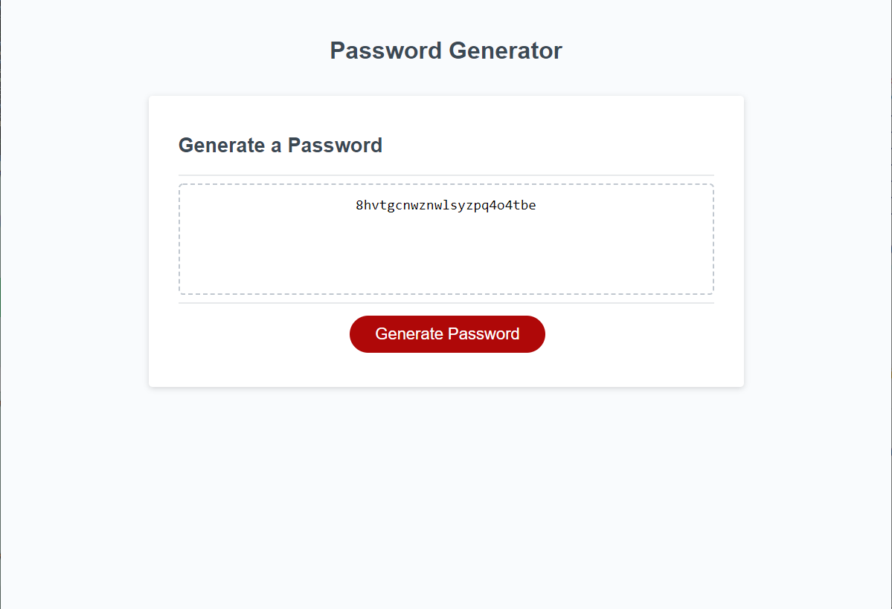

# Password-Generator
Generates a random password of determined length 8-128 characters with users choice of lowercase, uppercase, numeric and special characters.
Links to the repository https://github.com/dlucarelli/Password-Generator and the working application https://dlucarelli.github.io/Password-Generator/
Image from application;

N/A Installation Instructions
Application created with resources from w3schools.com, and assistance from Ryan Garza, Carl Koepke, Samer Saadoun, Brooklynne Audette, Kieran Anthony, Matt Johnson, and Gage Eide
